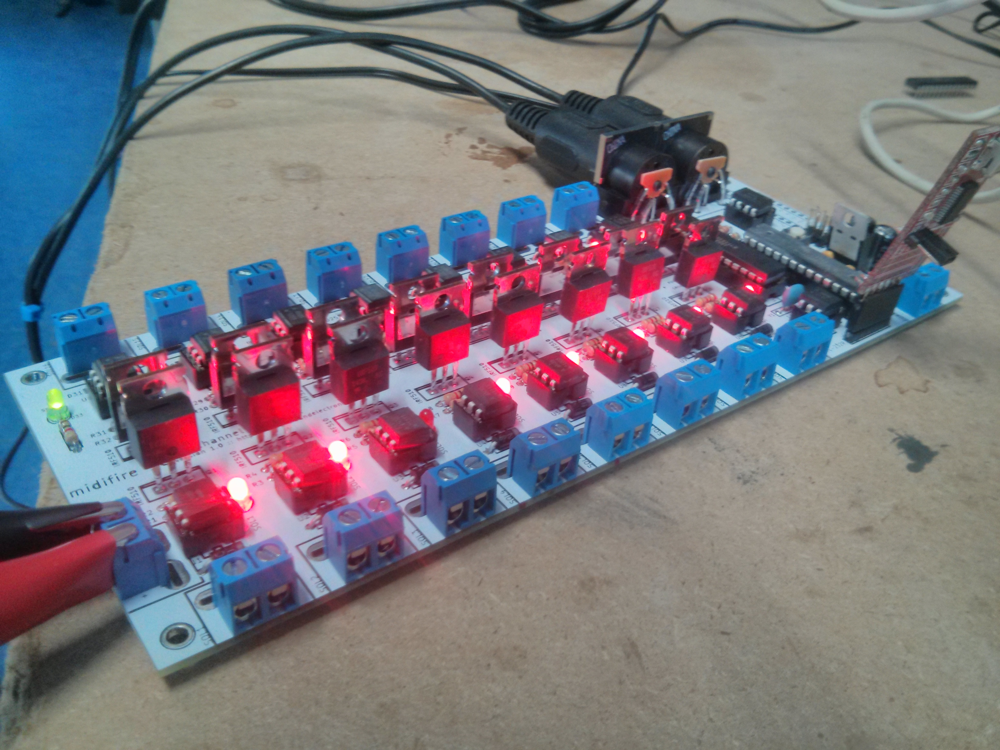

midifire16
---------

The midifire16 is an Arduino-compatible 16 channel solid state relay board with built-in RS-485 serial. It is the wired version of the [wifire16](https://github.com/propane-and-electrons/wifire16) - much more information on the SSR side of the board is available there.

The MIDI connection is compatible with any number of Arduino libraries, so the midifire16 can be used to control LED strip lighting or flame effects with any MIDI software.

### Feature Summary

* Arduino compatible
* Programmable via 6-pin FTDI header or 6-pin ICSP header
* 16 DC load channels switched via MOSFET
* MIDI compatible via DIN 5/180deg connectors
* MIDI IN and OUT connectors, with THRU implemented in firmware
* All ATMega I/O pins are broken out on the board
* DC load power is optoisolated from the control system power
* Power connectors use 5mm screw terminals or Anderson Powerpole connectors
* Load power status is reported to the microcontroller via an optoisolated input pin
* Output power channels are controlled with a TLC5940 constant current driver that works like a shift register
* Each output channel has a status LED for easy debugging
* TLC5940 control lines are broken out to input/output headers, so boards can be chained without additional control systems

### Documents

* [Schematic](docs/midifire16-schematic.pdf)
* [Bill of Materials](docs/midifire16-BOM.csv)
